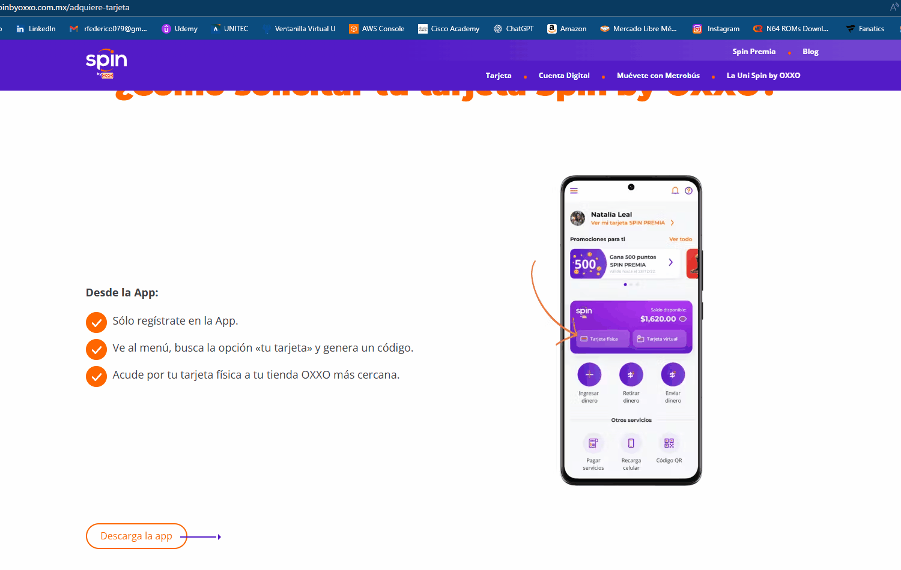

#  QA Report: Portal Oxxo Web

Auditoría de calidad enfocada en la experiencia de usuario (UX) y la funcionalidad de los filtros de promociones en el sitio oficial de Oxxo.

##  Bugs Detectados

### 1. Menús de Promociones Vacíos (Andatti / Spin Premia)
* **Descripción:** Al seleccionar los filtros de "Andatti" o "Spin Premia" en la sección de promociones, el sistema no carga productos y muestra un mensaje de "Sin Resultados".
* **Impacto:** **Medio.** El usuario percibe falta de contenido o fallos en el inventario.
* **Evidencia:**  | 

### 2. Bucle de Redirección en "Descarga la App"
* **Descripción:** Al intentar descargar la aplicación desde una PC, el sistema redirige a una página informativa de la tarjeta Spin en lugar de enviar al usuario a la Store o mostrar un código QR de descarga. Al reintentar, se genera un ciclo de navegación sin éxito.
* **Impacto:** **Alto.** Pérdida de conversión de usuarios interesados en la aplicación móvil.
* **Evidencia:** 

##  Tabla de Resultados

| ID | Caso de Prueba | Resultado | Observaciones |
| :--- | :--- | :--- | :--- |
| TC-OXXO-01 | Buscador de Tiendas | **PASSED**  | Los pins de Google Maps coinciden con las direcciones. |
| TC-OXXO-02 | Filtros de Categoría | **FAILED**  | Los menús específicos no muestran información. |
