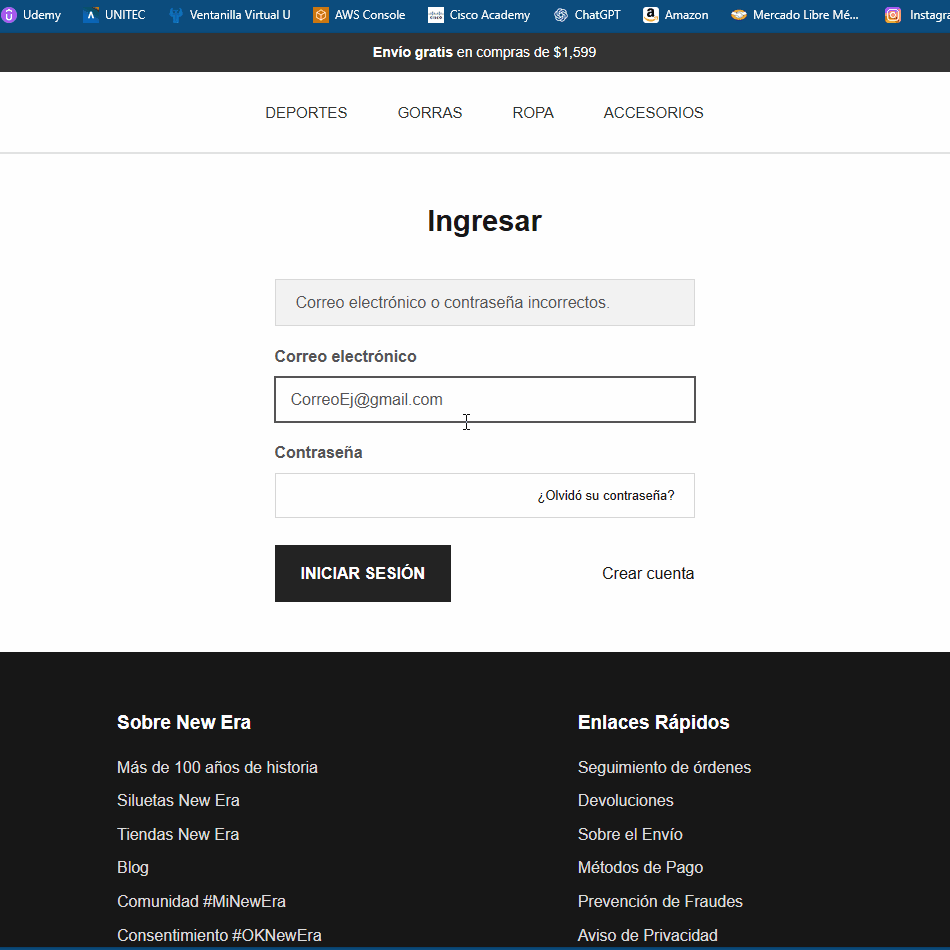

# QA_Manual
Pruebas Quality Assurance manuales
#  QA Portfolio: Pruebas Exploratorias - New Era (México)

Este proyecto consiste en una auditoría de calidad (QA Manual) realizada al sitio web de New Era México. El objetivo fue identificar fallos críticos en el flujo de compra y errores de interfaz de usuario (UI) que afectan la experiencia del cliente.

##  Herramientas Utilizadas
* **Navegador:** Google Chrome (DevTools para inspeccionar elementos).
* **Documentación:** Markdown para reportes técnicos.
* **Evidencia:** ScreenToGif para la captura de errores en tiempo real.

## 📋 Resumen de Actividades
Se ejecutaron pruebas exploratorias y casos de prueba funcionales enfocados en:
1. **Flujo de Checkout:** Validación de direcciones y métodos de envío.
2. **Gestión de Cuentas:** Proceso de Login y recuperación de contraseña.
3. **Buscador y Filtros:** Relevancia de resultados y ordenamiento.

---

##  Bugs Críticos Encontrados

### 1. Error de Validación en Dirección de Envío
* **Descripción:** El sistema bloquea el paso al pago mostrando un error de "Corrija los errores de dirección" a pesar de que la dirección seleccionada es válida y está guardada.
* **Impacto:** **Bloqueante.** Impide que el usuario finalice su compra.
* **Evidencia:** 

### 2. Traslape de Elementos en Login (UI Bug)
* **Descripción:** El icono de "Ver contraseña" se superpone al enlace "¿Olvidó su contraseña?", afectando la usabilidad.
* **Evidencia:** 

---

## ✅ Ejecución de Casos de Prueba (Test Cases)

| ID | Caso de Prueba | Resultado | Observaciones |
| :--- | :--- | :--- | :--- |
| TC-001 | Aplicar cupón inválido | **PASSED**  | El sistema rechaza códigos falsos correctamente. |
| TC-002 | Filtro Precio: Menor a Mayor | **PASSED**  | Los productos se ordenan de forma ascendente. |
| TC-003 | Búsqueda sin sentido | **FAILED**  | El buscador devuelve basura en lugar de un mensaje de "No resultados". |

---

##  Aprendizajes 
* Identificación de **falsos positivos** en algoritmos de búsqueda.
* Diferenciación entre errores de **lógica de negocio** (validación de dirección) y errores de **diseño** (traslape de UI).
